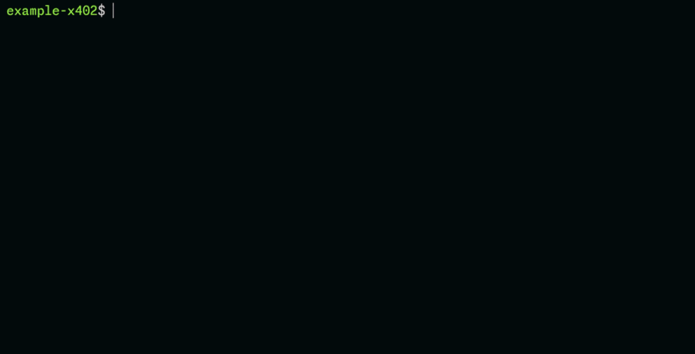

# Lemma × x402 — ZK-verified agent payments on Base Sepolia

> **Agentic payments run on x402. Agentic trust runs on Lemma.**

x402 lets agents pay. Lemma proves *who* paid and *under what authority* — cryptographically, on-chain, without exposing the underlying data.

This repo is a reference implementation: an HTTP 402 flow where every micropayment carries a ZK proof of data authenticity, a BBS+ selective disclosure, and a settlement proof — all verifiable by any agent or smart contract.

<div align="center">
  


*Demo: Agent fetches content → discovers attestation → pays $0.001 via x402 → receives ZK-verified attributes → selectively discloses specific fields*</div>

---

## The problem this solves

Agents can already move money. What they can't do is prove anything about themselves or the data they receive:

| Without Lemma | With Lemma |
| :--- | :--- |
| Anonymous transfer | ZK-proven agent ID (issuer + role + policy) |
| "Trust me" self-report | On-chain verifiable attributes |
| No provenance on received data | Cryptographic integrity binding per response |

One middleware call turns every x402 payment into a verifiable trust event.

---

## What happens in this demo

```
Agent ──[GET /article]──────────────────▶ Content Source
                                               │
                               X-Lemma-Attestation header
                                               │
        [$0.001 USDC via x402]                │
              │                               │
              ▼                               │
        Lemma Worker ◀─────────────────────────┘
              │
              ├─ Attribute proof   author, date, integrity (Poseidon commitment)
              ├─ Payment proof     settlement confirmed on Base Sepolia
              └─ Minimal disclosure  only the fields the agent requested (BBS+)
              │
              ▼
        Agent receives: { author, published, integrity } — nothing more
```

### What each layer proves

| Layer | Claim | Mechanism |
| :--- | :--- | :--- |
| **Attribute authenticity** | Author, date, body haven't been tampered with | Poseidon Merkle commitment + SHA-256 integrity |
| **Payment settlement** | Payment occurred for the stated amount | x402 facilitator → settle on Base Sepolia |
| **Minimal disclosure** | Verifier sees only the requested fields | BBS+ signature over normalized attributes |

A blog article is the entry-point example. The architecture generalizes to any verifiable data: credentials, sensor readings, financial attestations, research outputs, on-chain events.

---

## Quick Start: Demo Steps (5 minutes)

Experience the 4-phase provenance verification demo where an agent pays and verifies data.

### Prerequisites
- Node.js 20+, pnpm 9+
- Base Sepolia wallet with test USDC ([Circle Faucet](https://faucet.circle.com/))

```bash
git clone https://github.com/lemmaoracle/example-x402
cd example-x402
pnpm install
```

### 1. Configure

```bash
cp .env.example .env
# Required: PAY_TO_ADDRESS, AGENT_PRIVATE_KEY
```

### 2. Start the worker

```bash
pnpm dev:worker   # → http://localhost:8787
```

> Set `DEMO_MODE=true` in `packages/worker/.dev.vars` to skip real payment verification during local development.

### 3. Run the agent

```bash
# Standard flow: fetch → discover attestation → pay → verify
pnpm agent

# Advanced flow: also queries POST /query for BBS+ selective disclosure
pnpm agent:disclosure
```

---

## How to integrate with your own content

There are three integration approaches, from most direct to most standard:

### Option A — Direct middleware (recommended starting point)

Apply the x402 payment middleware to your resource endpoint:

```typescript
import { paymentMiddleware } from "@x402/hono";
import { HTTPFacilitatorClient, x402ResourceServer } from "@x402/core/server";
import { ExactEvmScheme } from "@x402/evm/exact/server";

const facilitator = new HTTPFacilitatorClient({
  url: "https://x402-facilitator.lemma.workers.dev",
});
const resourceServer = new x402ResourceServer(facilitator)
  .register("eip155:84532", new ExactEvmScheme());

const routes = {
  "GET /verify/:hash": {
    accepts: [{ scheme: "exact", price: "$0.001", network: "eip155:84532", payTo }],
    extensions: { lemma: { schema: "blog-article-v1" } },
  },
};

app.use("*", paymentMiddleware(routes, resourceServer));
```

### Option B — Discovery headers (pull-based, agent-compatible)

Add these headers to any content response; compliant agents discover attestation automatically:

```http
X-Lemma-Attestation: https://your-worker.workers.dev/example/verify/0xabc123
X-Lemma-Schema: blog-article-v1
```

Or as an HTML meta tag:

```html
<link rel="lemma-attestation"
      href="https://your-worker.workers.dev/example/verify/0xabc123"
      type="application/json+lemma" />
```

### Option C — AI user-agent redirection

Serve humans normally; redirect AI agents to the x402 gateway:

```javascript
// scripts/ai-redirect.js — drop into any page
const aiPatterns = ["OpenAI", "Claude", "GPT", "Bot", "Crawler"];
if (aiPatterns.some(p => navigator.userAgent.includes(p))) {
  window.location.href = `https://your-worker.workers.dev/ai-content/${slug}`;
}
```

WordPress users: see `scripts/wordpress-ai-redirect.php`.

---

## Registering your own content

The `blog-article-v1` schema is pre-deployed — no circuit work needed to get started.

### Step 1 — Generate a BBS+ key pair (one-time)

```bash
pnpm generate-keypair
# Save secretKey as CI secret: LEMMA_BBS_SECRET_KEY
```

### Step 2 — Normalize and commit

```typescript
import { create, schemas, define, prepare } from "@lemmaoracle/sdk";

const client = create({ apiBase: "https://workers.lemma.workers.dev" });

const schemaMeta = await schemas.getById(client, "blog-article-v1");
const schema = await define(schemaMeta);

const prep = await prepare(client, {
  schema: schema.id,
  payload: {
    title:       "My Post",
    author:      "did:example:you",
    body:        "Full article text...",
    publishedAt: "2026-04-21T12:00:00Z",
    lang:        "en",
  },
});
// prep.normalized   → { author, published, integrity, words, lang }
// prep.commitments  → { scheme: "poseidon", root, leaves, randomness }
```

### Step 3 — Sign and create selective disclosure

```typescript
import { disclose } from "@lemmaoracle/sdk";

const header   = new TextEncoder().encode("blog-article-v1");
const messages = disclose.payloadToMessages(prep.normalized);

const signed = await disclose.sign(client, {
  messages,
  secretKey,       // from generate-keypair
  header,
  issuerId: "did:example:you",
});

// Reveal title (index 5) and body (index 1) only
const revealed = await disclose.reveal(client, {
  signature: signed.signature,
  messages:  signed.messages,
  publicKey: signed.publicKey,
  indexes:   [1, 5],
  header,
});

const sd = disclose.toSelectiveDisclosure(revealed, {
  publicKey: signed.publicKey,
  header,
  count: messages.length,
});
```

### Step 4 — Register with Lemma

```typescript
import { documents, proofs } from "@lemmaoracle/sdk";

const docHash = `0x${prep.normalized.integrity}`;

await documents.register(client, {
  schema:      schema.id,
  docHash,
  issuerId:    "did:example:you",
  subjectId:   "did:example:you",
  attributes:  prep.normalized,
  commitments: {
    scheme:     "poseidon",
    root:       prep.commitments.root,
    leaves:     prep.commitments.leaves,
    randomness: prep.commitments.randomness,
  },
});

await proofs.submit(client, {
  docHash,
  circuitId:  "blog-article-v1",
  proof:      "",
  inputs:     [
    prep.normalized.author,
    String(prep.normalized.published),
    prep.normalized.integrity,
    String(prep.normalized.words),
    prep.normalized.lang,
  ],
  disclosure: sd,
});
```

### GitHub Actions — auto-register on push

```yaml
name: Register articles with Lemma
on:
  push:
    paths: ["content/**"]
jobs:
  register:
    runs-on: ubuntu-latest
    steps:
      - uses: actions/checkout@v4
      - uses: pnpm/action-setup@v4
      - run: pnpm install
      - name: Register new/changed articles
        env:
          LEMMA_BBS_SECRET_KEY: ${{ secrets.LEMMA_BBS_SECRET_KEY }}
          LEMMA_API_BASE: https://workers.lemma.workers.dev
        run: pnpm tsx scripts/register.ts
```

---

## Bring your own data

`blog-article-v1` is only the entry-point schema. Lemma handles any JSON document — credentials, sensor readings, financial attestations, research outputs, on-chain events.

To define a custom schema and circuit:
1. Write a Rust WASM normalize function (`packages/normalize`) and a Circom circuit (`packages/circuit`).
2. Build artifacts: `wasm-pack build --target web` and `./scripts/build.sh`.
3. Register: fill in `PINATA_API_KEY`, `PINATA_SECRET_API_KEY`, `LEMMA_API_KEY` in `.env` and run `pnpm register`.

Pre-deployed schemas and circuits (no setup needed):

| Type | ID | Purpose |
| :--- | :--- | :--- |
| Schema | `passthrough-v1` | Simple passthrough for any payload |
| Schema | `blog-article-v1` | Blog article normalization |
| Circuit | `x402-payment-v1` | Proves on-chain payment (Base Sepolia) |
| Circuit | `blog-article-v1` | Verifies blog article attributes |

---

## Attribute schema (blog-article-v1)

| Attribute | Type | Description |
| :--- | :--- | :--- |
| `author` | `string` (DID) | Provable authorship identity |
| `published` | `number` (Unix sec) | Publication timestamp for freshness checks |
| `integrity` | `string` (SHA-256 hex) | Body content hash — tamper detection |
| `words` | `number` | Word count |
| `lang` | `string` (ISO 639-1) | Language |

---

## API endpoints

| Endpoint | Method | Description |
| :--- | :--- | :--- |
| `/example/verify/:hash` | GET | Provenance verification — verified attributes + proof status |
| `/example/query` | POST | BBS+ selective disclosure query |
| `/` | GET | Health check |

---

## Network

**Base Sepolia** (`chainId: 84532`)

| Resource | Value |
| :--- | :--- |
| RPC | `https://sepolia.base.org` |
| Explorer | `https://sepolia.basescan.org` |
| x402 Facilitator | `https://x402-facilitator.lemma.workers.dev` |
| USDC contract | `0x036CbD53842c5426634e7929541eC2318f3dCF7e` |

---

## Project structure

```
packages/
  worker/     Cloudflare Worker — Hono + x402, /verify + /query endpoints
  agent/      Node.js agent — 4-phase provenance verification demo
  circuit/    Circom circuit — blog-article-v1 (pre-deployed)
  normalize/  Rust WASM — rawDoc → normDoc (pre-deployed)
scripts/
  register.ts                   Register articles in CI
  register-with-full-content.ts Register articles with paid-tier body access
  generate-bbs-keypair.ts       Generate BBS+ key pair
  generate-snippet.ts           Generate X-Lemma-Attestation header + <link> tag
  ai-redirect.js                Client-side AI user-agent detection
  wordpress-ai-redirect.php     WordPress plugin for server-side AI detection
  check-balance.ts              Check agent wallet USDC balance
```

---

## Roadmap

- **Agent DID binding** — derive `did:key` from the agent's signing key, bind to `issuerId`; every payment cryptographically linked to a specific principal.
- **Role and policy attributes** — attach org-level roles and permission scopes as verifiable attributes for policy-gated payments.
- **On-chain DID verification** — Circom constraint `authorHash == poseidon(did:key)` makes identity part of the ZK proof itself.

---

## Further reading

- [Lemma Oracle](https://lemma.frame00.com) — ZK-verified data attestations
- [Lemma Blog: Cryptographic Trust Chains Between Agents](https://lemma.frame00.com/blog/agent-cryptographic-trust-chain-a2a-api-economy)
- [x402 Protocol](https://x402.org) — HTTP-native micropayments
